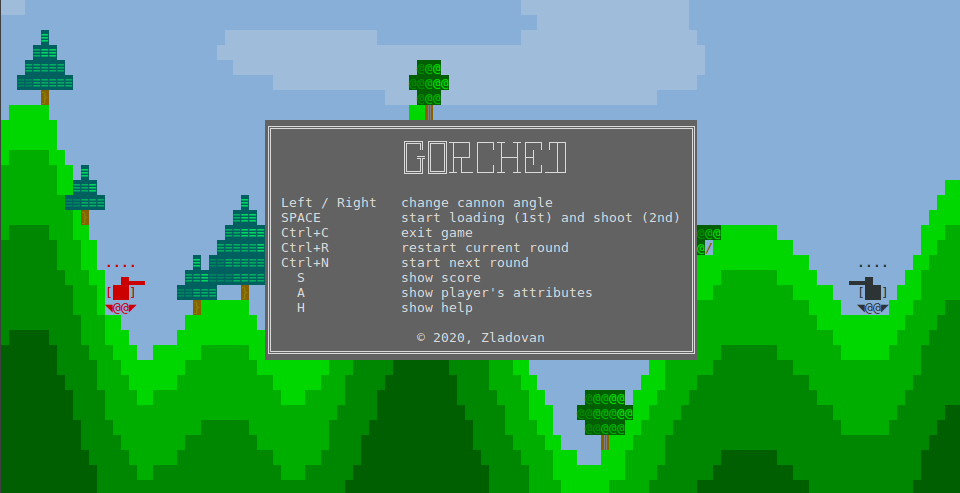

# Gorched

Gorched is terminal based game written in [Go](https://golang.org/) inspired by "The Mother of all games" [Scorched Earth](https://en.wikipedia.org/wiki/Scorched_Earth_(video_game)).

> How the game looks like depends on your terminal !

## Features

 - rendered in terminal
 - ASCII graphics (actually few unicode symbols were used)
 - procedurally generated world
 - terrain destruction
 - turn based multiplayer

## Try online

You can try Gorched online on [gorched.zladovan.repl.run](http://gorched.zladovan.repl.run/).

>Performance in online terminal can be worse than in real terminal !

## Installation

### General

Download archive for your platform from [releases page](https://github.com/zladovan/gorched/releases/latest) and unpack it to some directory on your file system.

### Linux

If you are using [snap](https://snapcraft.io/docs/installing-snapd) just run:
    
    sudo snap install gorched

### MacOS

If you are using [homebrew](https://brew.sh/) just run:

    brew install --cask zladovan/tap/gorched

### Windows

If you are using [scoop](https://scoop.sh/) run:

    scoop bucket add zladovan https://github.com/zladovan/scoop-bucket
    scoop install gorched

## How to start

Just type `gorched` in terminal or run unpacked binary named `gorched` respectively `gorched.exe`.

## How to play

Gorched currently has only one mode where two players are playing locally against each other. The goal is to find out correct angle and power to hit the enemy tank. Gameplay is turn based and each player has one attempt per turn. When some player hits the enemy he gains score and game continues in next round with different terrain.

### Controls

- <kbd>←</kbd> <kbd>→</kbd> change angle of cannon
- <kbd>SPACE</kbd> start loading (1st hit) and shoot (2nd hit)
- <kbd>Ctrl</kbd>+<kbd>C</kbd> exit game 
- <kbd>Ctrl</kbd>+<kbd>R</kbd> restart current round
- <kbd>Ctrl</kbd>+<kbd>N</kbd> start next round
- <kbd>S</kbd> show score
- <kbd>A</kbd> show player's attributes
- <kbd>H</kbd> show help 

> When running from browser use just <kbd>R</kbd> / <kbd>N</kbd> instead of <kbd>Ctrl</kbd>+<kbd>R</kbd> / <kbd>Ctrl</kbd>+<kbd>N</kbd>

## How to run from source code

Alternatively you can run Gorched from source code.

    git clone https://github.com/zladovan/gorched.git
    cd gorched
    go run cmd/main.go

>You need to have [git](https://git-scm.com/downloads) and [golang](https://golang.org/dl/) installed locally

## Troubleshooting

### When you see the question marks 

When there are question marks instead some parts of the tank sprite it's probably because your terminal does not support unicode characters. Start game with `--ascii-only` flag and different sprite based only on ACSII characters will be used.

### When you see weird colors

The exact colors used in the game depends on your terminal support and settings. So they can be a lot different as the colors in the showcase. When they are too weird or you see some big white areas start game with `--low-color` flag to use only basic 8 colors. Graphics would look simpler but it should be better.

## Credits

Gorched is using [termloop](https://github.com/JoelOtter/termloop) as game engine.

Procedural generation is based on OpenSimplex noise implemented in Go by [opensimplex-go](https://github.com/ojrac/opensimplex-go).
